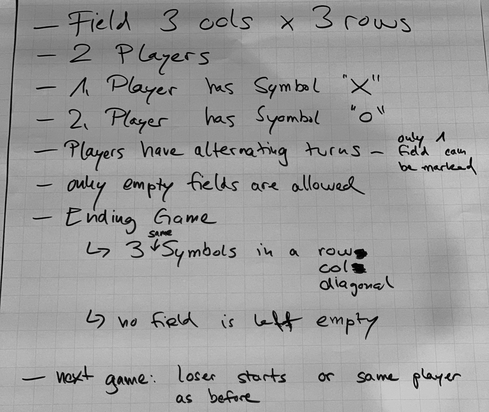

# Test-Driven Development
## Sebastian Bergmann and Stefan Priebsch

> Writing good code with automated tests does pay off, even more on the long run, when major changes to your software become necessary. In this workshop, we will introduce you to Test-Driven Development as it was meant to be. You will not only understand how TDD fundamentally challenges how you have thought about software to this day, but also experience the joy of the red-green-refactor cycle. Join Sebastian and Stefan on a journey that might forever change the way you think about code. And tests, for that matter. Make sure to bring your own laptop with a current PHP and PHPUnit version, there will be plenty of room for you to work on exercises while being individually coached by the trainers.
>
> https://thephp.cc/dates/2019/10/international-php-conference/test-driven-development

Code written for/during the "Test-Driven Development" workshop at the International PHP Conference 2019.

This is example code that is not production-ready. It is intended for studying and learning purposes.

(c) 2019 thePHP.cc. All rights reserved.

### How-To

* `php tools/phpab -o src/autoload.php src`: Generate autoloader
* `php tools/phpunit`: Run tests
* `php tools/psalm`: Run type checker
* `php tools/php-cs-fixer fix`: Format code

### Result of 1-2-4-All

[1-2-4-All](http://www.liberatingstructures.com/1-1-2-4-all/) to gather the requirements for Tic-Tac-Toe.

